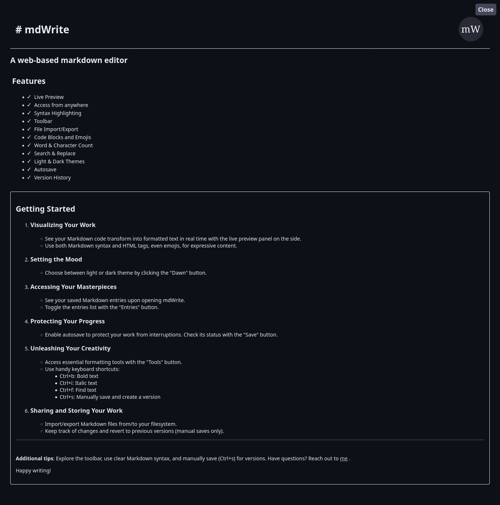
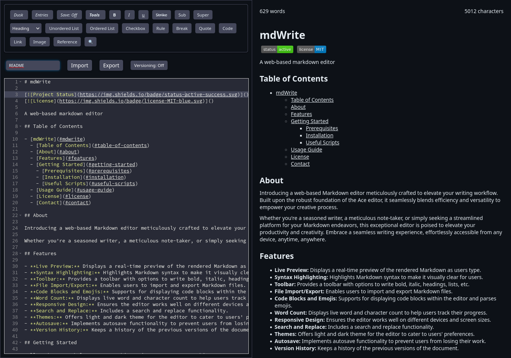

# mdWrite

A web-based markdown editor

## Table of Contents

- [mdWrite](#mdwrite)
  - [Table of Contents](#table-of-contents)
  - [About](#about)
  - 
  - [Features](#features)
  - [Getting Started](#getting-started)
    - [Prerequisites](#prerequisites)
    - [Installation](#installation)
    - [Useful Scripts](#useful-scripts)
  - [Usage Guide](#usage-guide)
  - [License](#license)
  - [Contact](#contact)

## About

---

Introducing a web-based Markdown editor meticulously crafted to elevate your writing workflow. Built upon the robust foundation of the Ace editor, it seamlessly blends efficiency and versatility to empower your creative process.

Whether you're a seasoned writer, a meticulous note-taker, or simply seeking a streamlined platform for your Markdown endeavors, this exceptional editor is poised to elevate your productivity and creativity. Embrace a seamless writing experience, effortlessly accessible from any device, anytime, anywhere.

## Features

- **Live Preview:** Displays a real-time preview of the rendered Markdown as users type.
- **Syntax Highlighting:** Highlights Markdown syntax to make it visually clear for users.
- **Toolbar:** Provides a toolbar with options to write bold, italic, headings, lists, etc.
- **File Import/Export:** Enables users to import and export Markdown files.
- **Code Blocks and Emojis:** Supports for displaying code blocks within the editor and parses emojis.
- **Word Count:** Displays live word and character count to help users track their progress.
- **Responsive Design:** Ensures the editor works well on different devices and screen sizes.
- **Search and Replace:** Includes a search and replace functionality.
- **Themes:** Offers light and dark theme for the editor to cater to users' preferences.
- **Autosave:** Implements autosave functionality to prevent users from losing their work.
- **Version History:** Keeps a history of the previous versions of the document.

## Getting Started

Follow the steps below to setup this project on your own machine.

### Prerequisites

Make sure you have the latest version of nodejs and git installed on your system to follow the installation guide.

### Installation

- **Clone the repo**: `git clone https://github.com/shashotoNur/mdwrite.git`.
- **Enter the project directory:** `cd mdwrite`.
- **Install the necessary dependencies:** `npm install`.
- **Run the project locally:** `npm run dev`.

### Useful Scripts

You can deploy this app to your own github page.
- First change the remote git repo with `git remote set-url origin https://github.com/username/repo_name.git`.
- Verify the change with `git remote -v`.
- Build the project with `npm run build`.
- Finally use the following script to deploy `npm run deploy`.

## Usage Guide

**Key Features:**

- **Live Preview:** Observe a real-time visual representation of your Markdown code alongside the editor, encompassing support for HTML tags and Markdown emojis.
- **Theme Customization:** Toggle between light and dark themes effortlessly by clicking the designated "Dawn" button.
- **Entry Management:** Upon launch, the editor presents a list of Markdown documents (entries) stored within the browser. Access or conceal this list using the "Entries" button.
- **Autosave Functionality:** While disabled by default, the Autosave feature can be activated via the "Save" button, which concurrently indicates its current status.
- **Toolbar Accessibility:** Unveil a comprehensive toolbar harboring essential Markdown writing tools by engaging the "Tools" button.
- **Keyboard Shortcuts:** Streamline your workflow with the following shortcuts:
    - Ctrl+b: Render text in boldface.
    - Ctrl+i: Italicize text.
    - Ctrl+f: Initiate text searches within the active entry.
    - Ctrl+s: Preserve the active entry within the browser.
- **Import and Export Capabilities:** Effortlessly transfer entries between the editor and your local filesystem for seamless integration.
- **File Versioning:** Maintain a historical record of file alterations within the browser for enhanced content management. Note that Autosave-induced saves are excluded from versioning; this functionality applies exclusively to saves performed using Ctrl+s.

**Additional Notes:**

- **Autosave and Versioning:** Entries preserved via Autosave lack version history. To leverage versioning, employ Ctrl+s for manual saving.

- **Demo:** You can start crafting over [here](https://shashotoNur.github.io/mdwrite/).

## [License](LICENSE)

## Contact

